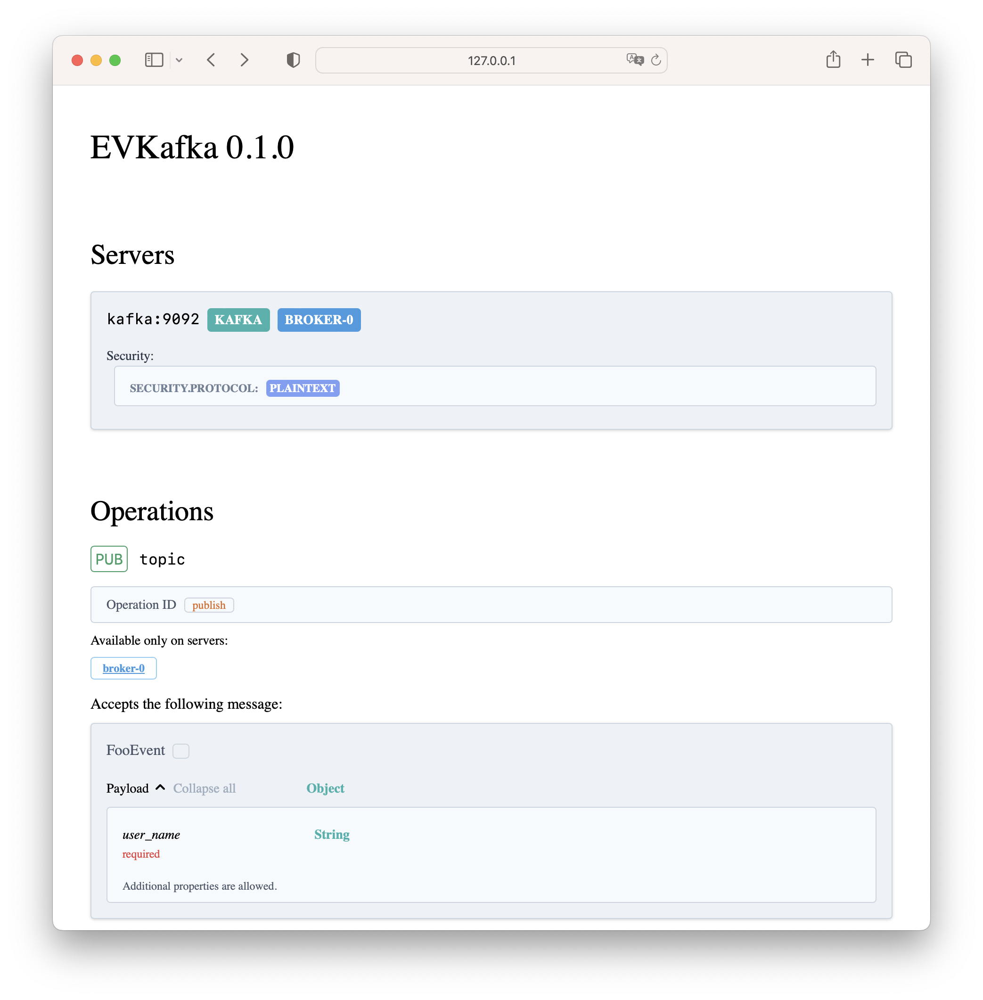

# evkafka

[](https://github.com/theleharo/evkafka/actions/workflows/test.yml)
[](https://coverage-badge.samuelcolvin.workers.dev/redirect/theleharo/evkafka)
[](https://pypi.org/project/evkafka/)

**EVKafka** is a lightweight framework for building 
event-driven microservices with Apache Kafka and Python.
It is based on the asynchronous Kafka client library 
[aiokafka](https://aiokafka.readthedocs.io/en/stable/).

## Features

- Easy to start and use
- Sync/async handlers are supported
- Extensible through consumer middleware
- Lifespan
- At-Least-Once/At-Most-Once event delivery guarantees
- Automatic API documentation generation

## Installation

     $ pip install evkafka

## Example

### Create a consumer

```python
from pydantic import BaseModel

from evkafka import EVKafkaApp
from evkafka.config import ConsumerConfig


class FooEventPayload(BaseModel):
    user_name: str


config: ConsumerConfig = {
    "bootstrap_servers": "kafka:9092",
    "group_id": "test",
    "topics": ["topic"],
}

app = EVKafkaApp(
    config=config,
    expose_asyncapi=True,
)


@app.event("FooEvent")
async def foo_handler(event: FooEventPayload) -> None:
    print(event)


if __name__ == "__main__":
    app.run()
```

### Explore API documentation

Automatic documentation (based on [AsyncAPI](https://www.asyncapi.com/)) is build and served at
http://localhost:8080.



### Add a producer

```python
from evkafka import EVKafkaApp, Handler, Request, Sender
from evkafka.config import ConsumerConfig, BrokerConfig, ProducerConfig
from pydantic import BaseModel


sender = Sender()
handler = Handler()


class FooEventPayload(BaseModel):
    user_name: str


class BarEventPayload(BaseModel):
    user_name: str
    message: str


@sender.event('BarEvent')
async def send_bar(event: BarEventPayload) -> None:
    pass


@handler.event("FooEvent")
async def foo_handler(event: FooEventPayload) -> None:
    print('Received FooEvent', event)
    new_event = BarEventPayload(user_name=event.user_name, message='hello')
    await send_bar(new_event)


@handler.event("BarEvent")
async def bar_handler(event: BarEventPayload) -> None:
    print('Received BarEvent', event)


if __name__ == "__main__":
    broker_config: BrokerConfig = {
        "bootstrap_servers": "kafka:9092"
    }

    consumer_config: ConsumerConfig = {
        "group_id": "test",
        "topics": ["topic"],
        **broker_config
    }

    producer_config: ProducerConfig = {
        "topic": "topic",
        **broker_config
    }

    app = EVKafkaApp(expose_asyncapi=True)
    app.add_consumer(consumer_config, handler)
    app.add_producer(producer_config, sender)
    app.run()
```

More details can be found in the [documentation](https://evkafka.readthedocs.io/)

## License

This project is licensed under the terms of the MIT license.
