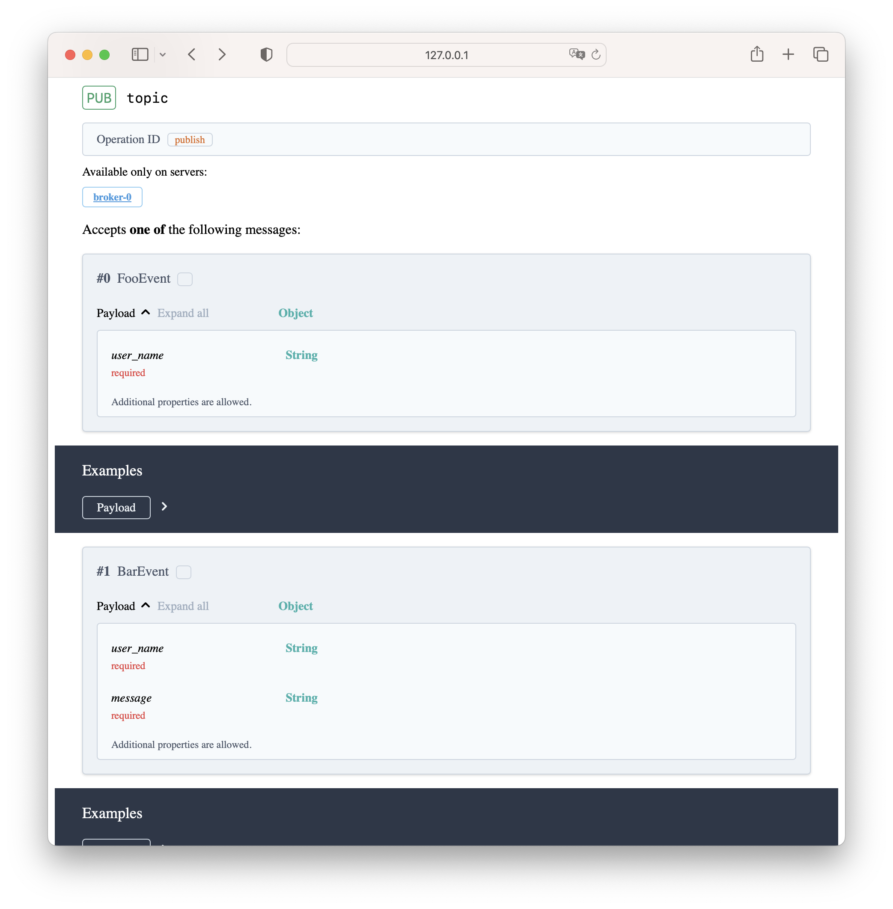

# Welcome to EVKafka

Handle kafka events easy.

**EVKafka** is a small framework for building event driven microservices 
with Apache Kafka and Python. It is based on asynchronous kafka client library 
[aiokafka](https://aiokafka.readthedocs.io/en/stable/).

Focus on event handling and the framework takes the rest.

## Features

- Easy to start and use
- Sync/async handlers are supported
- Extensible through consumer middleware
- Lifespan
- At-Least-Once/At-Most-Once delivery
- Automatic API documentation


## Installation

     $ pip install evkafka

## Introduction

### Build a consumer app

A simplest possible consumer app may look like this:

```python
from evkafka import EVKafkaApp
from evkafka.config import ConsumerConfig
from pydantic import BaseModel


class FooEventPayload(BaseModel):
    user_name: str


config: ConsumerConfig = {
    "bootstrap_servers": "kafka:9092",
    "group_id": "test",
    "topics": ["topic"],
}

app = EVKafkaApp(
    config=config,
    expose_asyncapi=True,
)


@app.event("FooEvent")
async def foo_handler(event: FooEventPayload) -> None:
    print(event)


if __name__ == "__main__":
    app.run()
```

The application connects to kafka broker and starts to read kafka messages. As soon as a message
of type `FooEvent` is received the app calls the handler function `foo_handler` with 
the message object in `event` parameter.

> **Note**. Kafka broker should be available at `kafka:9092` to run the example. 

### Explore API documentation

Automatic documentation (based on [AsyncAPI](https://www.asyncapi.com/)) is build and served at
[http://localhost:8080](http://localhost:8080).


In our example the topic becomes a channel `topic`. AsyncAPI describes the application
from a client perspective, e.g. the application expects `FooEvent` to be published to the channel.

### Add another event
It worth nothing to add another handler function to process different message type:

```python
class BarEventPayload(BaseModel):
    user_name: str
    message: str


@app.event('BarEvent')
async def bar_handler(event: BarEventPayload) -> None:
    print(event)
```

### Check documentation update

Restart your app. You should see an updated docs:


### Build a producer app

A helper class `EVKafkaProducer` may be used to produce events:

```python
import asyncio

from evkafka import EVKafkaProducer
from pydantic import BaseModel


class FooEventPayload(BaseModel):
    user_name: str

    
async def produce(event: BaseModel, event_type: str):
    config = {
        "topic": "topic", 
        "bootstrap_servers": "kafka:9092"
    }

    async with EVKafkaProducer(config) as producer:
        await producer.send_event(
            event=event,
            event_type=event_type,
        )

if __name__ == "__main__":
    asyncio.run(produce(FooEventPayload(user_name="evkafka"), "FooEvent"))
```

> **Feature Note.** Documentation for produced events will be included in next releases

### Produce events with EVKafka

A producer may be instantiated within a consumer app and used to produce new events:

```python
from contextlib import asynccontextmanager

from pydantic import BaseModel

from evkafka import EVKafkaApp, EVKafkaProducer, Handler, Request
from evkafka.config import ConsumerConfig, BrokerConfig, ProducerConfig


class FooEventPayload(BaseModel):
    user_name: str


class BarEventPayload(BaseModel):
    user_name: str
    message: str


handler = Handler()


@handler.event("FooEvent")
async def foo_handler(event: FooEventPayload, request: Request) -> None:
    print('Received FooEvent', event)
    new_event = BarEventPayload(user_name=event.user_name, message='hello')
    await request.state.producer.send_event(new_event, 'BarEvent')


@handler.event("BarEvent")
async def bar_handler(event: BarEventPayload) -> None:
    print('Received BarEvent', event)


@asynccontextmanager
async def lifespan():
    async with EVKafkaProducer(producer_config) as producer:
        yield {'producer': producer}


if __name__ == "__main__":
    broker_config: BrokerConfig = {
        "bootstrap_servers": "kafka:9092"
    }

    consumer_config: ConsumerConfig = {
        "group_id": "test",
        "topics": ["topic"],
        **broker_config
    }

    producer_config: ProducerConfig = {
        "topic": "topic",
        **broker_config
    }

    app = EVKafkaApp(
        expose_asyncapi=True,
        lifespan=lifespan
    )
    app.add_consumer(consumer_config, handler)
    app.run()
```